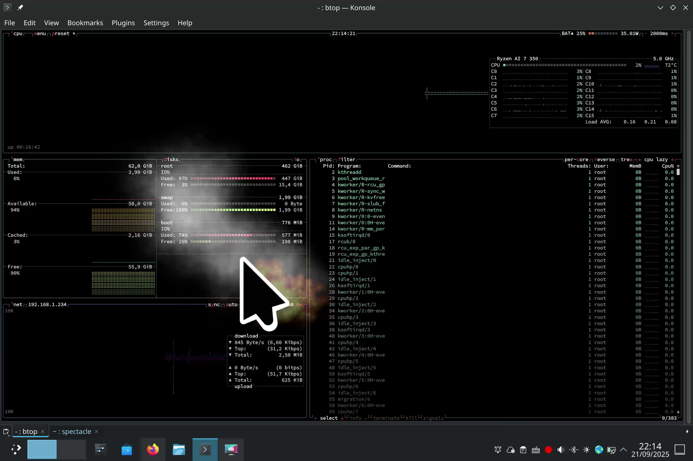

# New Shake Cursor effect

This is a silly project designed as a somewhat satirical response to the regular comments about the shake cursor effect and taking it to the conclusion of being more extreme with some smoke effects.



I don't intend to merge upstream (as it has no utility) nor to maintain this. It was mocked up one evening during Akademy.
However feel free to have a play or make it better and run with it.

## Building from Git

You will need the following dependencies to build this effect:

* CMake
* any C++20 enabled compiler
* Qt
* libkwineffects
* KDE Frameworks:
    - Config
    - CoreAddons
    - Extra CMake Modules
    - WindowSystem

### On Arch Linux

```sh
sudo pacman -S cmake extra-cmake-modules kwin
```

### On Fedora

```sh
sudo dnf install cmake extra-cmake-modules kf6-kconfig-devel \
    kf6-kconfigwidgets-devel kf6-kcoreaddons-devel kf6-kwindowsystem-devel \
    kwin-devel libepoxy-devel qt6-qtbase-devel
```


### On Ubuntu

```sh
sudo apt install cmake extra-cmake-modules kwin-dev \
    libkf5config-dev libkf5configwidgets-dev libkf5coreaddons-dev \
    libkf5windowsystem-dev qtbase5-dev
```

-----

After building be sure to disable the existing shake effect!
the effect:

```sh
git clone https://github.com/zzag/kwin-effects-sliding-notifications.git
cd kwin-effects-sliding-notifications
mkdir build && cd build
cmake .. \
    -DCMAKE_BUILD_TYPE=Release \
    -DCMAKE_INSTALL_PREFIX=/usr
make
sudo make install
```

